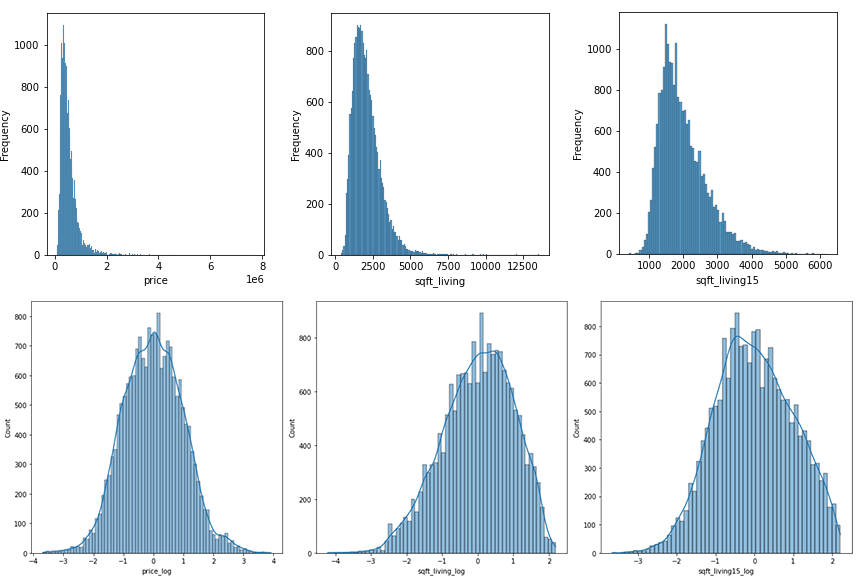

# Academy Xi Phase 2 Project

## Overview
This project is an opportunity to apply the concepts and techniques I have learned in Phase 2 and apply it using real world data. Through exploratory data analysis and linear regression, this report will generate 3 key insights that will aid in the decision making of a residential builder looking to make a presence in King County. It is important to understand the relationship each variable has with price so the residential builder can have a blueprint for their designs.

  

## Business Problem
A residential builder based in the USA has had much success on the east coast. They are looking to expand their market into the west coast of the USA, starting in King County, Washington. The residential builder would like to understand what factors influence the price of a house in that area.

The aim is to generate designs of a house based on those 5 factors and offer it as an option in King County. 

The model generated will be based on inference rather than prediction. I want to identify which features have a strong relationship with house price and see their effect. 

## Data Understanding

The dataset to be used for this model comes houses that were sold between 2014 and 2015 in King County, Washington. There are 21,597 entries containing a wide variety of information including features of the house (number bedrooms, bathrooms), location (zipcode, latitude, longitude) and ratings (view, grade).

## Method

An iterative approach was used for regression modelling to better understand the effect of architectural aspects of a house in relation to the price. Each iteration went through transformations in order to validate the linearity assumptions, address multicollinearity and reduce variance. These transformations included dropping variables with a weak correlation score and linear relationship, logarithmic transformations and mean normalisations to boost the performance of the model and reducing the data to within 2 standard deviations to address overfitting of the model.

 

## Evaluation
Using sklearn's feature selector the top 5 variables that have a strong relationship with the target variable price are:

* grade_11
* grade_12
* bathrooms_3.75
* view_3.0
* view_4.0

During each iteration, the P-values held true with the correlation heat map. This provided me with great confidence that the correct variables were being chosen to be used in the model. Additionally, it is important for data to synergise well with real world application. The top 5 variables are realistic in the sense that a typical person would consider these architectural features when evaluating the price of a house.

  

## Conclusion
In conclusion, in order for the east coast residential builder to be successful on the east coast, specifically King County, they must consider:

* **Creating a custom design using high quality materials, high quality finish work and luxurious options**
	- King County has a ranking system between 1 to 13 that represents the construction quality of improvements. They are generally defined as:

		+ **11** Custom design and higher quality finish work with added amenities of solid woods, bathroom fixtures and more luxurious options.

		+ **12** Custom design and excellent builders. All materials are of the highest quality and all conveniences are present.

The results Grade 11 and 12 sit on the higher end of the ranking system and is reflective of the model that has been produced. Investing in an excellent builder, high quality materials and luxurious options will yield a higher house price.

* **Incorporating 3 or more bathrooms into their designs**
	- Based on the statistical significance of the number of bathrooms throughout the iterations, it was observed that the number of bathrooms only started having a strong relationship with price at 3. Again this is reflective in the results at 3.75. The results suggest that many of the higher priced homes have a minimum 3 bathrooms.

* **Choosing a location of the house with a great view of local points of interest**
	- The features of the home are not the only important factors in raising the price of a house. The location is just as important and in this case, if the house has a view. King County has a variety of landmarks, ocean, lake and views. Opting to build a house within view of these natural and manmade points of interest and it will have a positive effect on the price.